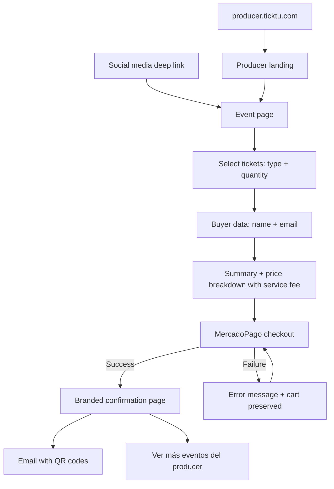

# UX Design Specification Ticktu

**Author:** Nacholc
**Date:** 2026-03-14

---

## Executive Summary

### Project Vision

Ticktu is a white-label multi-tenant ticketing platform that transforms event producers from marketplace dependents into independent brand owners. Each producer gets their own branded website (producer.ticktu.com) with complete operational tools and data intelligence. The MVP follows a managed-service model where the Ticktu team handles onboarding and branding configuration, targeting Uruguay's event market with Odisea as the launch client.

The core UX thesis: give producers the operational power of enterprise tools with the simplicity they need to run events without training, while giving buyers a purchase experience so fast and branded that they don't realize they're on a third-party platform.

### Target Users

**Producer Admin (Primary)** — Event production teams (e.g., Odisea) managing nightlife and event operations. Technically competent but not developers. Experienced with competitor platforms. Need a command center for events, not just a ticket sales page. Use desktop primarily for management, mobile for real-time monitoring during events.

**Buyer (Co-Primary)** — Mobile-first consumers aged 18-35 arriving via social media deep links. Expect sub-2-minute purchase flows, guest checkout, and immediate ticket delivery. Trust signals (MercadoPago, professional design) are critical for conversion. Zero tolerance for friction or downtime.

**Door Operator (Secondary)** — Event staff operating in high-pressure, low-connectivity environments (dark venues, crowds, spotty WiFi). Need an interface usable in 5 minutes without training, with unambiguous visual feedback and offline resilience. Speed and reliability trump all other concerns.

**RRPP / Promoters (Tertiary)** — No platform interface needed. Interact only through unique tracking URLs. Attribution is automatic and invisible to them.

### Key Design Challenges

1. **Multi-surface coherence** — Four distinct user types require purpose-built interfaces (power dashboard, conversion funnel, single-task scanner, admin panel) that share a unified design language without forcing inappropriate patterns across contexts.

2. **White-label brand fidelity** — Buyer-facing pages must convincingly carry each producer's brand identity while maintaining consistent, usable interaction patterns underneath. The platform must be invisible; the producer's brand must be front and center.

3. **High-pressure reliability UX** — Event night operations demand instant, unambiguous feedback in adverse conditions (dark environments, crowd noise, poor connectivity). The validation app must communicate results through color, size, and haptics — not text.

4. **Mobile-first social media conversion** — Buyers arrive with short attention spans from Instagram/TikTok. The purchase flow must eliminate every unnecessary step between landing and payment confirmation.

5. **Data visualization for operators** — Dashboards must surface actionable insights (peak times, RRPP performance, sales velocity) to non-technical producers without requiring data literacy.

### Design Opportunities

1. **"Command Center" event night experience** — The real-time dashboard during a live event (check-ins, revenue, device-level scan tracking) can deliver the emotional "wow" moment that cements producer loyalty and differentiates from competitors.

2. **Branded reveal onboarding** — The first time a producer sees their fully branded site is a high-emotion moment. Designing this as a deliberate reveal can anchor the value proposition immediately.

3. **Trust-by-association checkout** — Seamless MercadoPago integration borrows established payment trust, reducing buyer hesitation on an unfamiliar producer domain.

## Core User Experience

### Defining Experience

Ticktu has two critical experience surfaces with a clear priority hierarchy:

**Priority 1 — Buyer Purchase Flow:** The conversion tunnel from social media link to ticket-in-hand. This is the revenue engine — if it fails, nothing else matters. The buyer must feel they're on a premium, trustworthy site that happens to be the producer's own brand. Speed, polish, and quality perception are non-negotiable.

**Priority 2 — Producer Command Center:** The operational hub where producers create events, monitor sales, and run their business. This must feel like a premium tool — not the cheap, dashboard-less experience competitors offer. Producers need to open their account for the first time and immediately feel "yes, this is what I want." Rich data visualization, polished UI, and intuitive navigation — but never at the cost of speed or simplicity.

### Platform Strategy

| Surface | Platform | Primary Input | Key Constraint |
|---------|----------|---------------|----------------|
| Buyer purchase flow | Mobile web (responsive) | Touch | Performance, deep link support, no app install |
| Producer dashboard | Web (desktop-first, responsive) | Mouse/keyboard | Data-dense layouts, real-time updates |
| Producer event-night monitoring | Mobile web (responsive) | Touch | Quick glances at live data |
| Validation app | Mobile web / PWA | Touch + camera | Online-first with connection status indicator, low-light environments _(offline capability descoped 2026-03-19)_ |
| Ticktu admin panel | Web (desktop) | Mouse/keyboard | Multi-tenant management |

No native apps for MVP. All surfaces are web-based, leveraging PWA capabilities for the validation app (online-first with connection status indicator — ~~offline support~~ descoped 2026-03-19).

### Effortless Interactions

**Buyer — Zero-friction purchase:**
- Landing page loads instantly from social media deep link
- Event details and ticket options visible without scrolling on mobile
- Ticket selection → checkout in minimum taps
- Guest checkout — no account creation ever
- MercadoPago handles payment seamlessly
- Confirmation + email with QR codes within seconds
- The entire flow should feel premium: smooth animations, polished component transitions, micro-interactions that signal quality — without compromising load times or performance

**Producer — Intuitive power:**
- Event creation that flows naturally without documentation
- Real-time dashboard that surfaces insights at a glance — no digging
- RRPP link generation in one action
- Settlement reports that answer "how did I do?" immediately
- The platform should feel fast and responsive — every click has immediate feedback

**Door Operator — Reliable technology:** _(Updated to online-first 2026-03-19)_
- Point camera → get answer. Nothing else needed
- When connection drops, a "Sin conexión" banner informs the operator scanning is paused
- When connection returns, banner disappears and scanning resumes automatically

### Critical Success Moments

1. **Buyer: "That was easy"** — Purchase completed in under 2 minutes from Instagram tap. The site felt professional, fast, and trustworthy. Tickets arrived before they put their phone down.

2. **Producer: "This is what I've been looking for"** — First login reveals a polished, branded dashboard with rich visualizations and clear navigation. It feels premium, not cheap. It feels like *their* platform.

3. **Producer: "I can finally see everything"** — During a live event, the real-time dashboard shows check-in velocity, RRPP performance, revenue by ticket type, peak entry times — data they never had access to before, presented beautifully.

4. **Door Operator: "It just works"** — 400 scans in a night, zero failures, zero confusion. Clear connection status when wifi drops. Technology disappeared behind the task.

### Experience Principles

1. **Quality is trust** — Every pixel communicates reliability. Smooth animations, polished transitions, and premium component behavior signal to buyers that this is a safe place to spend money, and to producers that this is a serious business tool. Never sacrifice performance for aesthetics — the quality must be real, not decorative.

2. **Invisible complexity** — The platform handles 13 features, multi-tenancy, offline sync, and real-time data. The user sees none of this. Each surface shows only what's relevant, when it's relevant, with zero cognitive overhead.

3. **Data as insight, not noise** — Producers left competitors because dashboards felt cheap and data was invisible. Ticktu's visualizations must be rich, beautiful, and immediately readable. Every chart answers a question the producer actually has.

4. **Speed is the feature** — For buyers, speed is conversion. For producers, speed is efficiency. For door operators, speed is crowd safety. Every interaction must feel instant. Loading states should be rare and brief.

5. **Brand-first, platform-second** — On buyer-facing pages, the producer's brand dominates. Ticktu's infrastructure is invisible. The buyer should feel they're on Odisea's website, not a ticketing platform.

## Desired Emotional Response

### Primary Emotional Goals

| User | Primary Emotion | Supporting Emotion | Differentiating Feeling |
|------|----------------|-------------------|------------------------|
| **Buyer** | Confidence — "this is legit and safe" | Speed satisfaction — "that was painless" | Quality perception — "this feels premium" |
| **Producer** | Pride — "this is MY platform" | Empowerment — "I can see everything" | Premium feel — "this is a serious business tool" |
| **Door Operator** | Certainty — "green means go" | Calm — "it just works, every time" | Invisible reliability — technology fades into the background |

### Emotional Journey Mapping

**Buyer Emotional Arc:**
- **Discovery (Instagram tap):** Curiosity → immediate reassurance (fast load, branded, professional)
- **Browsing event:** Interest → clarity (event details clear, ticket options obvious)
- **Checkout:** Zero anxiety (guest checkout, MercadoPago trust signals, transparent fees)
- **Post-purchase:** Satisfaction + confidence (instant email, QR codes ready)
- **Event night:** Ease (quick scan, no friction at the door)
- **If something goes wrong:** Reassurance, not frustration (clear error messages, cart preserved, easy retry)

**Producer Emotional Arc:**
- **First login:** Pride + excitement ("this is what I've been looking for")
- **Event creation:** Flow — intuitive enough to feel natural, no documentation needed
- **Pre-event monitoring:** Anticipation — watching sales build in real-time
- **Event night dashboard:** Thrill — seeing live data they never had before
- **Post-event settlement:** Clarity + satisfaction — "here's exactly how I did"
- **If something goes wrong:** Supported and in control — clear paths to resolution, Ticktu partnership feel

**Door Operator Emotional Arc:**
- **Setup:** Quick confidence — "I understand this immediately"
- **Scanning:** Mechanical certainty — no decisions, just clear answers
- **Peak traffic:** Calm under pressure — the tool keeps up, no bottlenecks
- **Connection loss:** Informed, not panicked — clear "Sin conexión" banner, knows to wait for connection _(updated from "unaware" to "informed" — online-first 2026-03-19)_

### Micro-Emotions

**Critical micro-emotions to cultivate:**
- **Trust over skepticism** — Every visual choice on buyer pages must signal professionalism. No generic templates, no stock-feeling layouts.
- **Confidence over confusion** — At every step, the user knows where they are, what to do next, and what just happened.
- **Accomplishment over frustration** — Task completion should feel rewarding. Subtle feedback (animations, confirmation states) reinforces success.
- **Excitement over indifference** — The producer dashboard should make data feel alive, not static. Real-time updates create engagement.

**Critical micro-emotions to prevent:**
- **Anxiety** — Buyer worrying about payment security or ticket delivery
- **Cheapness** — Producer feeling the tool is a downgrade from competitors
- **Overwhelm** — Producer facing too many options or cluttered interfaces
- **Doubt** — Door operator second-guessing a scan result
- **Panic** — Any user encountering an error without a clear recovery path

### Design Implications

| Emotional Goal | UX Design Approach |
|---------------|-------------------|
| **Confidence (Buyer)** | Professional typography, consistent spacing, MercadoPago badge visible early, HTTPS lock, branded consistency |
| **Speed satisfaction (Buyer)** | Skeleton loaders instead of spinners, optimistic UI updates, minimal form fields, single-page checkout feel |
| **Pride (Producer)** | Their logo prominent in dashboard header, their colors reflected in UI accents, "powered by" minimal or absent |
| **Empowerment (Producer)** | Rich but readable charts, clear KPI cards, data always fresh, export capabilities visible |
| **Premium feel (Both)** | Smooth animations (300ms ease curves), polished transitions, consistent micro-interactions, generous whitespace |
| **Certainty (Door Operator)** | Full-screen color feedback (green/red), large text, haptic vibration on scan, no secondary information during scan |
| **Calm under pressure (Door Operator)** | Clear "Sin conexión" banner when offline (operator knows scanning is paused), scan history scrollable but not prominent _(updated from subtle dot to explicit banner — online-first 2026-03-19)_ |

### Emotional Design Principles

1. **Emotion through craft, not decoration** — Premium feel comes from precise spacing, smooth animations, and consistent behavior — not from gradients, shadows, or ornamental elements. Quality is felt, not seen.

2. **Errors are conversations, not dead ends** — When something fails, the UI should feel like a helpful guide: explain what happened, what the user can do, and preserve their progress. Never blame the user.

3. **Celebrate quietly** — Success states (purchase complete, event published, scan valid) should feel affirming but not over-the-top. A smooth checkmark animation, a brief color confirmation — not confetti or modals.

4. **Data creates excitement** — Live-updating numbers, subtle chart animations on load, and real-time indicators transform static dashboards into living command centers. The producer should want to keep watching.

5. **Absence is trust** — The most trusted systems are the ones you don't think about. Payment processing, ticket delivery, offline sync — these should be so reliable that users forget they could fail.

## UX Pattern Analysis & Inspiration

### Inspiring Products Analysis

#### Apple.com — The Gold Standard for "Alive" Design
- **Whitespace as pacing** — Generous spacing controls cognitive load. Premium feel through restraint.
- **Typography economy** — Large, bold headlines with minimal supporting text. Sophistication through subtraction.
- **Motion philosophy** — Transitions under 300ms, consistent easing. Animation serves understanding, never distraction.
- **Dual-action patterns** — "Learn more" paired with "Buy" respects different user intents.

**Key takeaway for Ticktu:** Premium feel from precision in spacing, typography, and subtle motion — achievable with any component library through careful configuration and consistent tokens.

#### Orano.group — Corporate Elegance with Life
- **Modular content cards** — Visual richness without clutter.
- **Progressive disclosure** — Content reveals in layers, keeping interfaces clean.
- **Scroll-triggered reveals** — Elements animate into view, giving pages a sense of life.

**Key takeaway for Ticktu:** Card-based layouts with entrance animations make dashboards feel alive. Achievable with CSS transitions + intersection observers — no heavy animation library needed.

#### Xceed.me & Entraste.com — Ticketing Reference (with caveats)

**Important distinction:** Both are **marketplaces** — multi-producer discovery platforms with search, filtering, city selection, and browsing across many events. Ticktu is fundamentally different: each producer has their own site with only their own events. There is no cross-producer discovery.

**What's still relevant:**
- Card-based event display with hero images and clear CTAs
- Dark aesthetic for nightlife context
- Sequential purchase flow with step indicators
- Real-time availability feedback
- Urgency indicators for ticket scarcity
- Clean checkout with loading states

**What does NOT apply to Ticktu:**
- City/location-based navigation and discovery
- Search functionality across events
- Multi-producer browsing and filtering
- Marketplace-style event grids with dozens of options
- "Happening now" discovery features

**Ticktu's buyer page is simpler by design:** A producer's site shows only their events. The buyer journey is: land on producer site → see their events → pick one → buy. No search, no filters, no marketplace noise.

### Transferable UX Patterns

**Motion & Life (achievable with shadcn + CSS):**
- Subtle fade-in on component mount (CSS `@keyframes` or minimal `framer-motion`)
- Smooth accordion/collapsible transitions for progressive disclosure
- Number counters that animate on viewport entry (dashboard KPIs)
- Skeleton loading states via shadcn's built-in Skeleton component
- Hover states with gentle scale (1.02x) via CSS `transition: transform 200ms ease`

**Purchase Flow (simple, linear):**
- Step indicator showing 1-2-3 progress
- Single-page feel with sections that reveal sequentially (no full page reloads)
- Real-time ticket availability shown on selection
- Clear price breakdown before payment
- Loading state on submit button to prevent double-clicks
- Confirmation view with order summary + "check your email" guidance

**Event Display (producer site — NOT marketplace):**
- Producer landing page: hero with brand imagery, upcoming events as cards below
- Event cards: image, name, date, venue, single CTA ("Comprar")
- Event detail page: event info + ticket type selection in one view
- Minimal navigation — the producer's site is small and focused

**Dashboard (producer — desktop-first):**
- KPI cards using shadcn Card with large numbers + trend arrows
- Charts via shadcn Charts
- Data tables with shadcn Table + sorting/filtering for order management
- Tabs for switching between event views
- Toast notifications for real-time updates (Sonner)

### Anti-Patterns to Avoid

| Anti-Pattern | Why It Fails | What to Do Instead |
|-------------|-------------|-------------------|
| **Over-engineering UI before core works** | Delays launch, fragile custom components | Start with shadcn defaults, refine later |
| **Marketplace patterns on a single-producer site** | Confusing — no need for search/filters on 3-5 events | Simple event list, direct navigation |
| **Static, lifeless dashboards** | Feels cheap — the problem producers are leaving | CSS animations on KPIs, real-time data updates |
| **Heavy animation libraries** | Kills mobile performance, complex to maintain | CSS transitions + minimal JS animation |
| **Complex multi-page checkout** | Every page load = drop-off on mobile | Single-page sequential flow |
| **Custom components when shadcn has them** | Reinventing the wheel, inconsistent quality | Use shadcn, customize with CSS variables |
| **Generic white-label templates** | All producers look the same, defeats brand promise | Customizable color tokens per producer |

### Design Inspiration Strategy

**Start simple, ship quality:**

A well-configured shadcn interface with good spacing, typography, and subtle motion beats a custom-built UI that's half-finished. Quality comes from consistency and attention to detail, not from complexity.

**Component layer — shadcn/ui covers ~95% of Ticktu's UI needs:**
- All form elements, cards, tables, tabs, dialogs, sheets, accordions
- Charts (shadcn Charts), data tables with sorting/filtering
- Toast/Sonner notifications, skeleton loaders, tooltips, popovers
- Navigation menus, breadcrumbs, dropdowns, command palette
- Stepper/progress patterns, badges, alerts

**Infrastructure layer — separate concerns, not component gaps:**

| Need | Library/Approach | Why it's separate from UI |
|------|-----------------|--------------------------|
| QR code generation | `qrcode.react` | Utility rendering, not interactive component |
| QR camera scanning | `html5-qrcode` or `zxing` | Device camera API access |
| Real-time data | WebSockets / SSE | Data transport layer — shadcn renders the result |
| White-label theming | CSS variables per tenant | shadcn natively supports CSS variable theming |
| PWA shell | Service workers (Serwist) | PWA install + shell only — ~~offline scanning via IndexedDB~~ descoped 2026-03-19 |
| Payment processing | MercadoPago JS SDK | External SDK handles payment UI |
| Email templates | `react-email` or similar | Server-side rendering, different context |

**Progression:**
- **MVP:** shadcn defaults with producer-customizable color tokens, basic fade-in animations, skeleton loaders
- **Post-launch:** Richer micro-interactions, animated KPI counters, chart entrance animations, scroll-triggered reveals on buyer pages

## Design System Foundation

### Design System Choice

**shadcn/ui + Tailwind CSS** — Themeable component system with full customization via CSS variables.

### Rationale for Selection

| Factor | Why shadcn/ui |
|--------|--------------|
| **White-label requirement** | CSS variable theming is native — Ticktu team swaps producer colors/fonts during setup |
| **Solo developer** | Pre-built, accessible components eliminate custom development for ~95% of UI needs |
| **Quality bar** | Built on Radix UI primitives — best-in-class accessibility, keyboard navigation, focus management |
| **Charts** | Built-in shadcn Charts cover all dashboard visualization needs |
| **Dark theme** | Native support via Tailwind's dark mode utilities + CSS variables |
| **"Alive" feel** | Easy to add motion via CSS transitions without fighting the library |
| **Performance** | No runtime CSS-in-JS overhead. Tailwind generates only used CSS classes |

### Implementation Approach

**Two-layer theming architecture:**

**Layer 1 — Ticktu Base Theme (to be designed):**
- Ticktu's own brand identity (logo, colors, typography) — applies to producer dashboard, admin panel, validation app
- Defines base design tokens: spacing scale, border radii, shadow depths, animation durations
- This is the consistent "Ticktu product" visual identity

**Layer 2 — Producer Brand Theme (per-tenant, Ticktu-configured):**
- Each producer's colors, logo, and imagery applied to buyer-facing pages
- **Configured exclusively by the Ticktu team** during onboarding — producers have no access to theme settings
- Changes to branding are requested through Ticktu support
- Stored as CSS variables per tenant, loaded based on subdomain

**Why no self-service customization:**
- Quality control — Ticktu ensures every producer's site looks premium
- Simplicity — no theme editor UI to build or maintain
- Security — no risk of producers breaking their own site
- Relationship — reinforces the "partner who listens" model from the product brief

**Component strategy:**
- Use shadcn components as-is for all standard UI (forms, tables, cards, dialogs, tabs, charts, etc.)
- Customize only via Tailwind classes and CSS variables — never fork component internals
- Build custom only when shadcn has no equivalent (scan result screen, QR scanner view)

### Customization Strategy

**Design tokens (CSS variables):**

```css
/* Ticktu base — dashboard, admin, validation app */
--ticktu-primary: ...;
--ticktu-background: ...;
--ticktu-foreground: ...;

/* Producer tenant — buyer-facing pages, set by Ticktu team */
--producer-primary: ...;
--producer-background: ...;
--producer-accent: ...;
```

**What Ticktu team configures per producer (during onboarding):**
- Primary and accent colors for buyer pages
- Logo and hero imagery
- Background colors/gradients
- Favicon

**What stays consistent across all producers (Ticktu-controlled):**
- Component behavior, spacing, border-radius, shadows
- Typography scale and weights
- Animation timing and easing
- Layout patterns and responsive breakpoints
- Accessibility compliance
- Dashboard UI theme (all producers use same Ticktu dashboard theme)

**Brand identity status:** Ticktu's own visual identity (colors, logo, typography) is not yet defined and will be designed as part of the implementation phase. The token-based architecture supports updating the brand without changing components.

## Defining Core Experience

### Defining Experience

**Buyer: "Tap → Buy → Done"**

The buyer's defining experience is the frictionless transition from social media to tickets-in-hand. No login, no account creation, no barriers. The interaction a buyer describes to friends: "I tapped the link on Instagram, picked my tickets, paid, and they were in my email in 2 minutes."

This is not a novel interaction — online ticket purchasing is well understood. Ticktu's differentiation is in what it removes: no account walls, no marketplace noise, no generic branding. The buyer lands on what feels like the producer's own website and buys directly.

**Producer: "Open → See Everything → Live"**

The producer's defining experience is the moment they open their dashboard and see their business in real-time — live ticket sales, revenue as it happens, not historical reports from yesterday. The interaction a producer describes to peers: "I can see every sale the moment it happens, how much I've made, which promoters are performing — all on my own platform."

### User Mental Model

**Buyer mental model:**
- Familiar pattern: social media link → product page → checkout → confirmation (same as any e-commerce)
- Expected friction points from competitors: forced login, account creation, browsing marketplace of other events
- Ticktu removes these: guest checkout, single-producer site, direct deep link to event
- Mental model preserved: select tickets → enter details → pay → receive. No new patterns to learn.

**Producer mental model:**
- Coming from competitors where dashboards feel "cheap" — basic tables, no real-time data, no visualizations
- Expects to log in and "check how things are going" — currently has to piece this together from multiple sources
- Ticktu transforms this: one login → everything visible, live, in one place
- Mental model shift: from "check reports after the event" to "watch my business in real-time"

**Door operator mental model:**
- Familiar with scanning apps from other ticketing platforms
- Expects: point camera → see result → next person
- Ticktu matches this exactly — no new mental model needed
- Connection awareness: clear "Sin conexión" banner if wifi drops — operator knows to wait _(updated from "invisible offline" to "informed online-first" 2026-03-19)_

### Success Criteria

**Buyer flow success:**

| Criteria | Metric | Why it matters |
|----------|--------|---------------|
| Zero login requirement | 0 account creation screens | Every login wall = conversion drop-off |
| Time to purchase | < 2 minutes from link tap to confirmation | Social media attention span is short |
| Immediate delivery | Tickets in email < 30 seconds after payment | Buyer confidence that it worked |
| Error recovery | Cart preserved on payment failure | Don't punish the user for card issues |
| Mobile-first | Fully functional on smartphone screens | 90%+ of buyers arrive from mobile |

**Producer dashboard success:**

| Criteria | Metric | Why it matters |
|----------|--------|---------------|
| Real-time sales | Live updates, no manual refresh | The defining "wow" moment |
| Revenue visibility | Current revenue shown prominently | First thing producers look for |
| First-login impact | Producer feels "this is what I wanted" on first visit | Retention starts at first impression |
| Zero training | Usable without documentation or onboarding tour | Producers are busy, won't read guides |
| Fast access | Dashboard loads < 2 seconds | Speed reinforces premium feel |

### Novel UX Patterns

**Ticktu uses established patterns, not novel ones.** This is intentional — from the product brief: "We're not trying to reinvent ticket purchasing, just do it better."

**Established patterns adopted:**
- E-commerce checkout flow (select → details → pay → confirm)
- Guest checkout (no account required)
- QR code ticket delivery via email
- Dashboard with KPI cards and charts
- Card-based event listings
- Camera-based QR scanning

**Ticktu's twist on established patterns:**
- **No marketplace layer** — buyer lands directly on producer's branded site, not a discovery platform. This simplifies navigation radically: no search, no filters, no categories.
- **Real-time as default** — dashboard data is live by default, not "pull to refresh" or "check back later." Numbers update as sales happen.
- **White-label invisibility** — the established checkout pattern is wrapped in the producer's brand, not Ticktu's. The platform disappears behind the producer's identity.

### Experience Mechanics

**Buyer Purchase Flow:**

1. **Initiation:** Buyer taps link on Instagram/TikTok story → lands on producer's branded event page
2. **Event view:** Event details (name, date, venue, description, images) + ticket types with prices and availability
3. **Selection:** Choose ticket type(s) and quantity → price updates in real-time including service fee
4. **Buyer details:** Name and email per ticket (minimal fields — no account creation)
5. **Payment:** MercadoPago checkout → familiar, trusted interface
6. **Confirmation:** Success screen with order summary → "Check your email for your tickets"
7. **Delivery:** Email arrives within seconds with unique QR per ticket

**Error states:** Payment declined → clear message + cart preserved → retry with different method. Never lose the selection.

**Producer Dashboard Flow:**

1. **Login:** Email/password → lands on dashboard home
2. **Dashboard home:** KPI cards showing today's numbers (tickets sold, revenue, check-ins) + trend charts
3. **Event management:** List of events by status (Draft, Published, Finished) → click to manage
4. **Event detail:** Sales data, ticket type breakdown, RRPP performance, batch status — all live
5. **Actions:** Create event, generate RRPP links, manage complimentary tickets, view customer database, access settlement reports

**Real-time behavior:** Sales numbers, revenue, and check-in counts update via polling refresh every 30 seconds (MVP decision — avoids WebSocket complexity). When a ticket is sold, the producer sees it reflected within the next refresh cycle.

## User Journey Flows

### Producer Dashboard Structure

#### Sidebar Navigation

Collapsible sidebar pattern (shadcn sidebar component). Desktop: full sidebar visible, collapsible to icons. Mobile: hamburger menu opens sidebar as overlay.

**Sidebar sections (final, validated in party mode):**

| Section | Purpose |
|---------|---------|
| **Dashboard** | Overview with KPIs, balance insight, charts |
| **Eventos** | List all events + create new. Click into event detail |
| **Ventas** | Global sales view cross-event. Includes "Ver todos los clientes" access link |
| **RRPP** | Promoter management: create, configure, assign links, activate/deactivate + performance rankings |
| **Boletería** | POS for physical/cash sales. MVP-confirmed feature |
| **Acreditación** | Check-in status per event + launch scanner app in new window |
| **Finanzas** | Unified view: Balance (general + per-event), Gastos (categorized expenses), Liquidaciones (settlements) |
| **[Usuario]** | Profile / account (bottom of sidebar) |

**Decision:** Clientes does NOT have its own sidebar section. Customer data is accessible from Ventas via a "Ver todos los clientes" link. Rationale: a dedicated Clientes section would duplicate data already visible in Ventas (Amelia, party mode).

**Decision:** RRPP has its own sidebar section because it serves a management purpose (CRUD of promoters, link assignment, configuration) beyond just viewing performance data.

#### Dashboard (Main Page Post-Login)

```
┌─────────────────────────────────────────────────────────┐
│  Dashboard                Últimos 30 días ▼  [+ Nuevo Evento]  │
├───────────┬───────────┬───────────┬───────────┬─────────┤
│  Tickets  │ Ingresos  │  Gastos   │  Balance  │ Eventos │
│  Vendidos │  $4.87M   │  $2.1M    │ +$2.77M   │ Activos │
│   3,247   │   UYU     │   UYU     │   UYU     │    3    │
│  ↑12.6%   │  ↑8.2%    │  ↑5.1%    │  ↑15.3%   │         │
├───────────┴───────────┴───────────┴───────────┴─────────┤
│  Ventas por día (area chart)   │  Rendimiento RRPP      │
│  [gráfico temporal]            │  [ranking list]        │
├────────────────────────────────┴────────────────────────┤
│  Ventas Recientes                                       │
│  [tabla con últimas transacciones]                      │
└─────────────────────────────────────────────────────────┘
```

5 KPI cards: Tickets Vendidos, Ingresos, Gastos, **Balance** (green if positive, red if negative), Eventos Activos. Balance is the hero metric — the producer sees profitability at a glance. This is a key differentiator: no competitor in LATAM offers real-time balance visibility.

#### Eventos (List View)

Tabs: **Activos | Borradores | Finalizados**

Event cards showing: image, name, date, venue, tickets sold, revenue. Single CTA to enter event detail. "+ Nuevo Evento" button always accessible.

#### Evento Detail (Tabs in Main Content)

When entering a specific event, the sidebar does NOT change. All event information is displayed in the main content area using tabs:

| Tab | Content |
|-----|---------|
| **General** | Event info, status, quick metric summary |
| **Ventas** | Tickets by type, batches, sales charts, transaction table |
| **RRPP** | Links generated, per-promoter performance for THIS event |
| **Cortesías** | Send/manage complimentary tickets for THIS event |
| **Check-ins** | Live accreditation status for THIS event |
| **Finanzas** | Revenue vs expenses for THIS event, add expenses directly |
| **Configuración** | Edit event details, dates, venue, images, etc. |

**Check-ins tab detail:**
- Scanned / Total counter with percentage
- Breakdown by ticket type (progress bars)
- Breakdown by accreditor (who scanned what)
- Entry velocity chart (check-ins per hour, peak time identification)
- Recent check-ins table (timestamp, ticket ID, type, accreditor)

#### Boletería (POS — Physical/Cash Sales)

MVP-confirmed feature. Accessible from sidebar for quick access by sales staff.

```
┌──────────────────────────────────────────────────┐
│  Boletería                    Evento: [▼ selector]│
├──────────────────────────────────────────────────┤
│  Tipo de ticket          Cantidad                 │
│  [radio selection]       [- 1 +]                  │
│                                                   │
│  Datos del comprador                              │
│  Nombre: _______________                          │
│  Email:  _______________                          │
│                                                   │
│  Método de pago                                   │
│  [Efectivo ●]  [Transferencia ○]                  │
│                                                   │
│  Total: $XX UYU                                   │
│  [ CONFIRMAR VENTA ]                              │
│                                                   │
│  ─── Últimas ventas de boletería ───             │
│  [recent POS sales table]                         │
└──────────────────────────────────────────────────┘
```

Flow: Select event once → type → quantity → buyer data → confirm. Tickets sent to buyer's email same as online purchase. Technical note (Winston, party mode): Boletería is a variant of the existing purchase flow — creates an order from backend instead of public checkout, with payment registered as "cash" or "transfer" instead of MercadoPago.

**Architect note:** Boletería requires role-based permissions — not every producer user should be able to sell cash tickets.

#### Finanzas (Unified View)

Single page combining Balance, Gastos, and Liquidaciones. Decision from party mode: keep it as one unified view instead of 3 sub-sections to avoid mini-ERP complexity.

**Balance section:**
- Net balance card (green positive / red negative)
- Balance breakdown per event (bar chart with profitability per event)
- Timeline chart: Ingresos vs Gastos vs Balance over time

**Gastos section:**
- "+ Agregar Gasto" button
- Category summary (donut chart: Venue, DJs, Security, Marketing, Other)
- Recent expenses table (description, event, amount, date)
- Filter by event

**Liquidaciones section:**
- Settlement reports from Ticktu
- Historical settlements per event

**Critical feature:** Balance visible at two levels:
1. **General balance** — cross-event, visible in Dashboard KPI + Finanzas page
2. **Per-event balance** — visible in Finanzas page + inside event detail Finanzas tab

### Buyer Purchase Flow

#### Entry Points

Two entry points, both important but weighted differently:

1. **Deep link from social media (primary, ~80%+ of traffic):** Buyer taps link on Instagram/TikTok → lands directly on the specific event page. This is where conversion happens.
2. **Producer landing page (secondary):** Buyer navigates to `producer.ticktu.com` directly → sees producer's branded landing → browses events.

#### Producer Landing Page (Template)

Simple, not heavy. Structure is a fixed template personalized by Ticktu team per producer during onboarding. Producers cannot self-customize.

```
┌──────────────────────────────────────────────────┐
│  [Logo Producer]                                  │
├──────────────────────────────────────────────────┤
│  ┌─ Hero ───────────────────────────────────┐    │
│  │  Brand image / banner                     │    │
│  │  Producer name                            │    │
│  │  Tagline / brief description              │    │
│  │  [Social media links]                     │    │
│  └───────────────────────────────────────────┘    │
│                                                   │
│  ─── Próximos Eventos ──────────────────────     │
│  [Event Card: image, name, date, venue, CTA]     │
│  [Event Card: image, name, date, venue, CTA]     │
│                                                   │
│  ─────────────────────────────────────────────   │
│  Powered by Ticktu (minimal footer)              │
└──────────────────────────────────────────────────┘
```

Events displayed on the same landing page, not on a separate page. Rationale: producers have few active events (2-5), no need for separate navigation. Less clicks = less abandonment.

#### Event Page

Event details (name, date, venue, description, images) + ticket types with prices and real-time availability. Single page, mobile-first. CTA: "Comprar" leading to checkout.

#### Purchase Flow



**Key decisions:**
- **Single email for all tickets:** If buyer purchases 3 tickets, all 3 QR codes go to the one email provided. Simplifies checkout to one form.
- **Guest checkout only:** No account creation, ever. Zero friction.
- **Confirmation stays branded:** Buyer sees confirmation on the producer's branded site, not a Ticktu page. Includes "Ver más eventos" as natural upsell.
- **Cart preserved on payment failure:** Clear error message, buyer retries without re-entering data.

### Validation App (Accreditation)

Standalone web app / PWA for door operators. Separate surface from producer dashboard.

#### Access

Single URL for the validation app. Each event has a unique access code generated by the producer. Producer distributes the code to their door staff. Accreditor enters: event code + their name.

```
┌──────────────────────────────────────────────────┐
│              TICKTU · Acreditación                │
├──────────────────────────────────────────────────┤
│  Código de acceso: _______________               │
│  Tu nombre: _______________                       │
│          [ INGRESAR ]                             │
└──────────────────────────────────────────────────┘
```

**Architect note:** Access code system, security model, and multi-event isolation to be defined in architecture phase.

#### Scanner (Primary Screen)

Camera viewfinder centered on screen. Minimal UI — event name, accreditor name, and historial button. Nothing else.

#### Scan Results — Full-Screen Color Feedback

**Valid ticket:** Entire screen turns GREEN with large checkmark. Returns to camera automatically after 2 seconds. Device vibration as reinforcement.

**Invalid ticket:** Entire screen turns RED with large X. Brief reason shown ("Ya fue usado" / "No válido"). Returns to camera automatically after 2 seconds. Device vibration as reinforcement.

Design rationale: Door operators work in dark, noisy, high-pressure environments. Color and size communicate faster than text. The result must be readable from 2 meters away.

#### History (Secondary, Accessible via Button)

Scrollable list: scanned count / total, recent scans with timestamp, ticket ID, type, and result (valid/invalid). Accessible but never interrupts the scanning flow.

#### Technical Constraints

- **10+ simultaneous devices** scanning for the same event. Duplicate detection must be centralized with low latency (Winston, party mode).
- **Online-first validation.** _(Descoped from offline fallback 2026-03-19)_ Connectivity required to scan. When offline, a "Sin conexión" banner is displayed and scanning is paused. No offline scanning, no IndexedDB cache, no sync queue.
- **Producer sees check-ins in near-real-time** from the dashboard (30s refresh cycle).

### Ticktu Admin Panel

Internal tool for Ticktu team only. **Functional and secure, no design priority.** Definition deferred to Architect for security, isolation, and structure decisions.

**Minimal structure:**

| Section | Purpose |
|---------|---------|
| Producers | CRUD producers + branding configuration |
| Subdomains | Subdomain management (producer.ticktu.com) |
| Fees | Commission configuration per producer |
| Refunds | Process refunds (Ticktu-managed) |
| Overview | Global metrics across all producers (post-MVP) |

**Critical requirement:** Security and isolation. Errors in admin panel must never affect producer or buyer experience.

### Journey Patterns

| Pattern | Where Applied | Rationale |
|---------|---------------|-----------|
| **Collapsible sidebar** | Producer dashboard | Standard navigation for data-dense apps. shadcn sidebar handles desktop + mobile |
| **Full-screen color feedback** | Validation app scan results | High-pressure, low-light environments need unambiguous visual signals |
| **Template with variable branding** | Buyer landing page | White-label requirement — fixed structure, customizable brand tokens |
| **Tabs in main content** | Event detail (7 tabs) | Avoids deep navigation, keeps sidebar stable, all info accessible |
| **Unified financial view** | Finanzas section | Avoids mini-ERP complexity, one page answers "how am I doing financially?" |
| **Event selector** | Boletería, Acreditación | Operational tools need quick event context without navigating through Eventos |

### Flow Optimization Principles

1. **Deep link direct to event** — never force passage through landing for social media traffic
2. **Single email receives all tickets** in a multi-ticket purchase — one form, no per-ticket data entry
3. **Accreditors access with simple code** — no account creation, producer distributes codes
4. **Balance visible at two levels** — general (Dashboard + Finanzas) and per-event (event detail Finanzas tab)
5. **30-second polling refresh** for dashboard data (MVP) — avoids WebSocket complexity while maintaining near-real-time feel
6. **Online-first validation** — validation app requires connectivity to scan; "Sin conexión" banner shown when offline, scanning resumes automatically on reconnect _(descoped from offline fallback 2026-03-19)_
7. **Admin Panel prioritizes security over aesthetics** — internal tool, must not break producer/buyer experience

### Notes for Other Agents

**For PM (John):**
- Add Gastos/Balance as MVP features to PRD (expense tracking + real-time profitability)
- Add Boletería as MVP feature to PRD (physical/cash POS)
- Clientes section removed from sidebar — accessible from Ventas
- RRPP section confirmed as management tool (not just performance view)

**For Architect (Winston):**
- Define security model for Admin Panel (isolation from producer/buyer)
- Design access code system for Validation App (per-event codes, multi-device)
- Online-first validation for Validation App — connection status indicator ("Sin conexión" banner) when offline, scanning paused _(offline/sync strategy descoped 2026-03-19)_
- Role-based permissions: admin vs. boletería staff vs. accreditor
- Boletería as backend variant of purchase flow (cash/transfer instead of MercadoPago)
- 30-second polling for dashboard data refresh (confirmed MVP approach)
- Balance calculation: revenue from sales minus loaded expenses, refreshed every 30s

## Component Strategy

### Design System Components (shadcn/ui)

shadcn/ui covers approximately 90% of Ticktu's component needs. All standard UI is built with shadcn components, customized only via Tailwind classes and CSS variables — never forking component internals.

| Component | Usage |
|-----------|-------|
| Sidebar | Producer navigation (collapsible, mobile-responsive) |
| Card | KPI cards, event cards |
| Table + DataTable | Sales, expenses, check-ins, POS history |
| Tabs | Event detail (7 tabs), event list (Active/Draft/Finished) |
| Charts (recharts) | Sales over time, balance timeline, check-in velocity, expense categories |
| Form / Input / Select | Boletería, buyer checkout, expense entry, event creation |
| Button | All CTAs across the system |
| Dialog / Sheet | Confirmations, add expense, send complimentary ticket |
| Badge | Event status, ticket types |
| Progress | Check-in progress bars by ticket type |
| Skeleton | Loading states for dashboard, tables |
| Sonner / Toast | Sale confirmed, expense added notifications |
| Dropdown Menu | Per-event actions, filters |
| Breadcrumb | Navigation: Eventos > Event Name |
| Radio Group | Ticket type selection (buyer + boletería) |

### Custom Components

**1. QR Scanner View**
- **Purpose:** Camera interface for scanning ticket QR codes in Validation App
- **Library:** `html5-qrcode` or equivalent
- **UI:** Functional wrapper around camera viewfinder, minimal design. No visual priority — must work reliably
- **States:** Loading camera, scanning, processing

**2. Scan Result Popup**
- **Purpose:** Clear feedback after scanning a QR code
- **UI:** Popup overlay (not full-screen). Shows VALID or INVALID with clear visual distinction
- **States:** Valid (green accent + checkmark), Invalid (red accent + X + reason)
- **Behavior:** Auto-dismiss after 2 seconds, device vibration as reinforcement
- **Accessibility:** Large text + color + haptics for triple redundancy in dark/noisy environments

**3. Ticket Quantity Selector**
- **Purpose:** Numeric stepper for selecting ticket quantities
- **UI:** [-] [number] [+] built with shadcn Button + Input primitives
- **Usage:** Buyer checkout, Boletería POS

**4. White-Label Theme Provider**
- **Purpose:** Load producer-specific branding (colors, logo) based on subdomain
- **Type:** Infrastructure component, not visual
- **Mechanism:** Detect subdomain → fetch producer tokens from DB (cached) → inject CSS variables into `:root`
- **Risk:** Low. shadcn natively supports CSS variable theming. Standard multi-tenant SaaS pattern (confirmed by Architect)

**5. Landing Template with Configurable Blocks (Level 2 Customization)**
- **Purpose:** Single template that serves all producer landing pages with visual and structural variation
- **Mechanism:** Template base without colors + configuration flags per producer to activate/deactivate blocks
- **Configurable blocks:** Hero (image/banner), social media links, about section, event list layout
- **Configured by:** Ticktu team during onboarding. Producers have no self-service access
- **Customization levels considered:**
  - Level 1 (implemented): Same structure, different colors/logo/images via CSS variables
  - Level 2 (implemented): Same base with toggleable blocks per producer (recommended sweet spot)
  - Level 3 (rejected for MVP): Completely different layouts per producer. Too costly to maintain and test — each new template multiplies QA effort. Producers choose Ticktu for the dashboard and data, not for unique landing architecture
- **Rationale:** 90% of the effect of "different websites" at 10% of the maintenance cost. Consistent structure ensures proven conversion patterns across all producers

### Component Implementation Strategy

- Build all standard UI with shadcn components — no custom alternatives for solved problems
- Custom components built using shadcn design tokens for visual consistency
- ReactBits may be used sparingly (1-2 effects) on producer landing pages for premium feel (hero text animations, entrance effects). Performance-gated: any effect that degrades mobile performance gets removed
- No dependency on 21st.dev — not aligned with current needs
- All custom components must work on mobile (touch-first, responsive)

### Implementation Roadmap

**Phase 1 — Core (needed for basic flows):**
- White-Label Theme Provider (required before any buyer-facing page)
- Ticket Quantity Selector (buyer checkout + boletería)
- Landing Template with configurable blocks

**Phase 2 — Operations (needed for event night):**
- QR Scanner View (validation app)
- Scan Result Popup (validation app)

**Phase 3 — Enhancement (post-launch polish):**
- ReactBits effects on landing pages (if performance allows)
- Balance Card color enhancement (green/red dynamic) if producers request it

## UX Consistency Patterns

### Feedback Patterns

**4-level feedback model** — each level maps to a specific component and context. Never use a higher level than necessary.

| Level | Type | Component | When to Use |
|-------|------|-----------|-------------|
| **1 — Ambient** | Non-critical success/info | `Sonner` (toast) | "Expense added", "Link copied", "Event saved as draft" |
| **2 — Inline** | Field validation | Text under input (red/green) | Form errors, real-time validation |
| **3 — Blocking** | Confirmation required | `AlertDialog` | "Publish event?", "Delete expense?", irreversible actions |
| **4 — Environmental** | Full sensory feedback | Custom (full-screen color + haptics) | Valid/invalid scan in validation app |

**Toast rules (Level 1 — Sonner):**
- Position: `bottom-right` on desktop, `top-center` on mobile
- Auto-dismiss: 3 seconds (success/info), 5 seconds (warning)
- Variants: `success` (green checkmark), `info` (neutral), `warning` (yellow, rare)
- **Errors never in toast** — errors always deserve Level 2 (inline) or Level 3 (dialog). Users must not hunt for a disappeared toast to understand what failed

**Inline feedback rules (Level 2):**
- Red error text below field, `text-sm`, input border changes to `border-destructive`
- Success: subtle green border (e.g., valid email in checkout)
- Appears on-blur or on-submit, never while the user is typing
- Auto-focus + scroll to first error on submit

**Blocking confirmation rules (Level 3 — AlertDialog):**
- Only for destructive or irreversible actions
- Always two clear options: action + cancel
- Destructive button uses `variant="destructive"` (red)
- Text explains the consequence, not just "Are you sure?"
- Good: "Deleting 'Noche Odisea' will cancel all sold tickets. This action cannot be undone."
- Bad: "Are you sure?"

**Environmental feedback rules (Level 4 — Validation App only):**
- Full-screen color overlay: green (#22c55e) = valid, red (#ef4444) = invalid
- Large text: "VALID" / "INVALID" + reason if invalid ("Already used", "Not found")
- Device vibration: short pulse = valid, double pulse = invalid
- Auto-dismiss: 2 seconds, returns to camera automatically
- **No buttons** — the operator should not touch the screen between scans

**Network errors and offline states:**

| Situation | Buyer | Dashboard | Validation App |
|-----------|-------|-----------|---------------|
| Momentary network loss | Silent retry, if fails → inline error with "Try again" | Warning toast "Intermittent connection" | **"Sin conexión" banner** — scanning paused until connection returns _(updated to online-first 2026-03-19; was "nothing visible, offline mode silently")_ |
| Payment failure | Clear inline error + cart preserved + "Try another payment method" | N/A | N/A |
| Dashboard operation fails | N/A | Error toast + retry link | N/A |
| Offline state | N/A | N/A | "Sin conexión" banner — scanning paused, operator informed to wait for connection _(updated to online-first 2026-03-19; was "subtle yellow dot, does not block")_ |

### Button Hierarchy

**Core rule: one Primary action visible per context.** Two primary buttons together cause hesitation — kills checkout conversion and creates dashboard confusion.

| Level | shadcn Variant | Usage | Example |
|-------|---------------|-------|---------|
| **Primary** | `default` | THE main action of the screen. Only one visible | "Pay", "Publish event", "Create event" |
| **Secondary** | `secondary` | Important complementary actions | "Save draft", "Preview", "Export" |
| **Outline** | `outline` | Tertiary, optional actions | "Add another ticket type", "Filter" |
| **Ghost** | `ghost` | Navigation or contextual actions | "Cancel", "Back", icon actions in tables |
| **Destructive** | `destructive` | Delete, cancel something irreversible | "Delete event", "Cancel ticket" |
| **Link** | `link` | Inline navigation within text | "View details", "See all clients" |

**Coexistence rules:**
- Primary never appears alongside another Primary
- Destructive always inside an AlertDialog (Level 3), never loose in the interface

**Button behavior by surface:**

- **Buyer checkout (mobile-first):** Primary = full-width, size `lg`, fixed to bottom (thumb zone). Always shows the amount: "Pay $2,500". Loading state: inline spinner + "Processing..." + disabled
- **Producer dashboard (desktop-first):** Primary = size `default`, right-aligned in section header. Table row actions: ghost buttons with icons (MoreHorizontal dropdown). Recurring pattern: title + primary CTA right-aligned
- **Validation app:** Almost no buttons. Only "Start scanning" on entry (primary, full-width, `lg`). After that, zero-button interface — everything automatic
- **Admin panel:** Same rules as dashboard. Destructive actions always in destructive + AlertDialog

**Icon buttons:**
- Icon-only buttons (`size="icon"`) only in space-constrained contexts (table rows, toolbar)
- Always with `tooltip` explaining the action
- On mobile, prefer text + icon over icon-only. Minimum touch target: 44x44px

**Button states:**

| State | Visual | When |
|-------|--------|------|
| `default` | Normal | Available for interaction |
| `hover` | Subtle shade change (shadcn default) | Mouse over (desktop) |
| `loading` | Spinner + text changes + disabled | Processing async action |
| `disabled` | Reduced opacity + cursor not-allowed | Condition not met (e.g., incomplete form) |

**Never hide a button** because a condition is not met — show it disabled. The user needs to know the action exists and what they're missing to activate it. If a user taps a disabled button, trigger form validation and show inline errors (Level 2) — the disabled button becomes a help trigger, not a silent wall.

### Form Patterns

**Stack: `react-hook-form` + `zod`** for every form, no exceptions. Typed validation schemas, consistent client-side validation, no full-form re-renders per keystroke.

**Validation timing — "lazy validation, eager re-validation":**

| Moment | Rule | Why |
|--------|------|-----|
| **On blur** (leaves field) | Validate that individual field | User finished writing, immediate feedback without anxiety |
| **On submit** | Validate everything, scroll to first error | Catch-all for skipped fields |
| **On change** | Only after first error on that field | User is correcting — show it's fixed in real-time |
| **Never while typing** | Do not validate during input | Annoying, creates anxiety, bad practice |

**Error display:**
- Red error text below field, `text-sm`
- Input border changes to `border-destructive`
- Auto-focus + scroll to first error on submit
- Messages must be **specific and human**, defined in the zod schema:
  - Good: "Enter a valid email (e.g., name@gmail.com)"
  - Bad: "Invalid field"
  - Good: "Select at least 1 ticket"
  - Bad: "Required field"

**Field organization by surface:**

**Buyer checkout — minimal, linear:**
- Per ticket: [Full name] + [Email]. Only those 2 fields
- Multiple tickets → labeled blocks: "Ticket 1", "Ticket 2", "Ticket 3"
- No columns on mobile — vertical stack, full-width
- Labels **above** the input, never placeholder-as-label (accessibility + clarity)
- Placeholder as hint: "e.g., juan@gmail.com"

**Event creation — progressive, by sections:**
- Long form divided into logical sections with clear headers
- Not a multi-page wizard (each page load = friction). Single form with visible sections
- Optional fields marked with "(optional)" next to the label
- Required fields **without asterisk** — it's the norm, not the exception. Only mark optionals
- Sections: Basic info → Tickets/pricing → Configuration → Publish

**Boletería POS — ultra fast:**
- Ticket type (select, pre-selected to most common) → Quantity selector (default: 1) → Payment method (cash/MercadoPago radio) → Submit
- Minimum possible fields. The producer is selling with people waiting in line

**Submit flow:**

| Phase | UX | Technical |
|-------|-----|----------|
| Pre-submit | Primary button visible (disabled if form incomplete) | Zod schema validates on-blur |
| Submit click | Validate all. If errors → scroll to first + focus | `form.handleSubmit()` from react-hook-form |
| Processing | Button → loading state (spinner + "Processing...") | Disable entire form to prevent editing |
| Success | Success toast (Level 1) + redirect or clear | Reset form if repeatable (POS), redirect if one-shot (checkout) |
| Server error | Toast or inline error depending on type | Field error (e.g., "email already exists") → inline. General error (e.g., timeout) → toast with retry |

**Critical checkout rule:** if payment fails, the form **preserves all data**. The user does not retype anything. Only retries payment or changes payment method.

### Loading & Empty States

**Two fundamentally different loading situations:**

| Situation | What happens | Correct pattern |
|-----------|-------------|-----------------|
| **Initial load** | User arrives at a screen for the first time | `Skeleton` — layout already visible, data fills in |
| **Data refresh** | Data updates via polling (every 30s) or user action | **In-place update** — data changes without flicker, no skeleton |

**Skeleton rules (initial load):**
- Use shadcn `Skeleton` matching the exact shape of the content
- KPI cards: skeleton for number + label + trend arrow
- Tables: skeleton for 5 rows with columns matching real headers
- Charts: rectangular skeleton with the chart's aspect ratio
- Expected duration: < 1 second. If a skeleton is visible for more than 2 seconds, it's a performance problem, not a UX problem
- Never a generic spinner. Always a skeleton that anticipates the layout

**In-place update rules (polling refresh):**
- Numbers change with CSS transition (200ms ease)
- No skeleton, no flash, no component re-mount
- Optional post-MVP polish: subtle background pulse (200ms) when a value changes, so the producer notices updates

**Buyer checkout loading:**

| Moment | UX |
|--------|-----|
| Landing page loading | Skeleton of event (hero image + title + ticket types). Must be < 1s |
| Calculating price | Inline, instant. Total updates without loading state — local calculation |
| Processing payment | Button in loading state + subtle overlay blocking form. Text: "Processing payment..." |
| Awaiting confirmation | Success screen with animated checkmark + "Check your email" |

Never a blank page. Never a spinner without context. The buyer always knows what's happening.

**Empty states — 3 distinct types with `<EmptyState />` reusable component:**

**First-use (onboarding):**
- Section-relevant icon (not generic)
- Positive, action-oriented title: "Create your first event", not "You have no events"
- Brief description of what to do
- Primary CTA leading to next step
- Tone: invitation, not absence

**No results (filter/search):**
- Icon: `SearchX` or similar
- Title: "No results found"
- Description: "Try adjusting filters or searching with different terms"
- CTA: "Clear filters" (secondary button)
- No drama — it's normal not to find something

**Error state (load failure):**
- Icon: `AlertTriangle`
- Title: "We couldn't load the data"
- Description: "It might be a connection issue. Try again."
- CTA: "Retry" (primary button that re-fetches)
- Connects to emotional design principle: errors are conversations, not dead ends

### Modal & Overlay Patterns

**Three overlay types, each with a clear purpose:**

| Component | When | Example |
|-----------|------|---------|
| **Dialog** | Short form or content that doesn't need context behind it | "Add expense", "Send complimentary ticket", "Generate RRPP link" |
| **Sheet** | Longer content or detail that benefits from seeing context behind | "Sale detail" from a table, "Advanced configuration" |
| **AlertDialog** | Destructive/irreversible action confirmation | "Delete event", "Cancel ticket" |

**Rule:** if the content has more than 4-5 fields or needs scroll, use Sheet. If it's a quick 2-3 field action, use Dialog.

**Implementation rules:**
- Dialog: fixed max-width, centered, overlay backdrop
- Sheet: desktop → slide from right (400-500px width); mobile → slide from bottom (85vh max)
- AlertDialog: always centered, always 2 buttons (cancel left + action right)
- `Escape` always closes
- Backdrop click closes Dialog and Sheet, but **not** AlertDialog (requires explicit decision)
- Focus trap active (shadcn/Radix handles automatically)
- Only one overlay open at a time — never modal over modal

### Navigation Patterns

**Producer dashboard:**
- shadcn Sidebar, collapsible
- Desktop: sidebar visible, collapsible to icons
- Mobile: hamburger → sidebar as overlay
- Breadcrumb for depth: `Events > Noche Odisea > Sales`
- Active state: background highlight + font weight (shadcn sidebar default: `bg-accent` + `font-medium`)

**Buyer flow:**
- No traditional navigation. Linear funnel
- Minimal header: producer logo + event name
- Step indicator in checkout: `1. Tickets → 2. Details → 3. Payment` (visual only, not clickable backwards)
- "Back" as ghost button, never rely on browser back

**Validation app:**
- No navigation. Single-screen: camera + results
- Minimal header: Ticktu logo + event name + "Sin conexión" banner when offline _(updated from subtle dot indicator — online-first 2026-03-19)_

**Admin panel:**
- Same as dashboard (sidebar + breadcrumb)

**Universal rule:** "Back" actions always use ghost variant button. Never depend on browser back navigation.

### Search & Filtering Patterns

Ticktu is not a marketplace — no global search, no discovery. Search/filter patterns are specific to data tables in the dashboard.

| Where | What's filtered | Pattern |
|-------|----------------|---------|
| Sales table | By date, ticket type, status | Inline filters above table (shadcn DataTable) |
| Event list | By status (Active/Draft/Finished) | Tabs, not filter — defined in Step 10 |
| Check-ins | By ticket type, status (valid/invalid) | Inline filters above table |
| Clients | By name, email | Simple search input above table |

**Implementation rules:**
- Search in tables: Input with Search icon, debounce 300ms, above the table
- Filters: Select/Dropdown inline next to search, not in a separate sidebar
- Tabs as filter: only for fixed categories (Active/Draft/Finished)
- Clear filters: ghost button "Clear" visible when filters are active
- No results: `<EmptyState>` no-results variant (defined above)
- No global search — we are not a marketplace

## Responsive Design & Accessibility

### Responsive Strategy

**Dual-first philosophy:** Ticktu's dashboard is not "desktop-first with mobile support" — it's designed for both contexts as primary. Desktop for complete management sessions, mobile for daily operations on the go (adding expenses, checking sales, monitoring events). Producers don't always carry a laptop.

**Shared component principle:** The same components adapt across breakpoints via Tailwind responsive utilities and CSS — no separate mobile/desktop component versions. A `<Card>` is a `<Card>` everywhere; only the grid container changes.

**Layout adaptation by surface:**

| Surface | Desktop (lg+) | Tablet (md) | Mobile (< md) |
|---------|---------------|-------------|---------------|
| **Producer dashboard** | Sidebar expanded + KPI grid 3-4 col + full tables | Sidebar collapsed to icons + 2 col grid + tables with horizontal scroll | Sidebar as overlay (hamburger) + vertical stack + KPIs stacked/2-col |
| **Buyer purchase flow** | Centered max-width 480px (simulates mobile) | Centered max-width 480px | Full-width native |
| **Validation app** | Centered max-width 400px | Full-screen | Full-screen |
| **Admin panel** | Sidebar + wide content | Sidebar collapsed + content | Sidebar overlay + vertical stack |

**Buyer flow desktop rule:** Never stretch the checkout to full-width on large screens. The flow was designed for mobile — a 1200px-wide checkout feels broken. Keep it in a narrow centered container (~480px) that preserves the mobile experience.

### Breakpoint Strategy

**Tailwind CSS defaults — no custom breakpoints:**

| Breakpoint | Tailwind Class | Ticktu Usage |
|-----------|---------------|-------------|
| `< 640px` | default (mobile) | Buyer flow, validation app, dashboard mobile |
| `640px` | `sm:` | Transition mobile → small tablet |
| `768px` | `md:` | Tablet, dashboard compact mode |
| `1024px` | `lg:` | Desktop, full dashboard |
| `1280px` | `xl:` | Wide desktop, admin panel optimal |

**Mobile-first CSS approach:** Base styles target mobile, media queries add desktop enhancements. This aligns with Tailwind's default methodology.

**Data-dense component adaptation on mobile:**

**Tables:**
- Do not force 8 columns into 375px — it's impossible
- Pattern: prioritized visible columns + "View detail" button opening Sheet (slide from bottom)
- Prioritized columns per table: Sales → date, amount, status. Check-ins → name, type, time
- Alternative for some tables: switch to **card layout** on mobile (each row = a card)

**Charts:**
- shadcn Charts (recharts) are responsive by default
- Mobile: vertical stack, one chart per row, full-width
- Desktop: 2-col grid for secondary charts, full-width for primary

**KPI cards:**
- Mobile: 2-col grid or full-width vertical stack
- Large numbers stay large — it's the first thing the producer wants to see

**Sidebar on mobile:**
- Hamburger icon (top-left) → sidebar overlay with backdrop
- Same content as desktop, touch-friendly sizing (48px height per item)
- Close on backdrop click or swipe left

### Accessibility Strategy

**Target: WCAG Level A** — pragmatic for MVP. The architecture supports scaling to AA if regulation or business needs require it.

**What shadcn/Radix provides for free:**
- Focus management in dialogs, sheets, popovers
- Keyboard navigation on all interactive components
- ARIA roles and labels on complex components (combobox, tabs, accordion)
- Focus trap in overlays
- Escape to close on all overlays

**What we implement ourselves (Level A requirements):**

| Requirement | Implementation | Effort |
|------------|----------------|--------|
| Semantic HTML | Use `<main>`, `<nav>`, `<header>`, `<section>`, `<button>` correctly | Low — discipline, not extra code |
| Alt text on images | All event images and logos with descriptive alt | Low |
| Color not as sole indicator | Scan result: color + text + icon + vibration (defined in Step 12) | Already resolved |
| Focus visible | Tailwind `focus-visible:ring` on all interactives | Low — Tailwind default |
| Touch targets 44x44px | All clickable buttons and links | Already defined in Step 12 |
| Page titles | Descriptive `<title>` on each route | Low |
| Form labels | Labels associated with inputs (defined: labels above, no placeholder-as-label) | Already resolved |
| Skip link | "Skip to main content" hidden until focus, top of page | Low |
| Focus order | Natural DOM order, no tabindex hacks | Low |
| Button vs link semantics | `<button>` for actions, `<a>` for navigation | Low |
| Aria-live regions | For real-time dashboard updates (announces changes to screen readers) | Low |
| Language attribute | `<html lang="es">` | Low |

**What we do NOT implement for MVP (Level AA/AAA):**
- Formal contrast ratio enforcement (4.5:1) — respected where possible but not formally audited
- Captions/transcripts — no video/audio content
- Complex ARIA patterns beyond what shadcn provides
- Formal 200% resize testing

**Uruguay legal landscape:** Law 18.651 covers disability protection, and AGESIC provides guidelines for government sites, but there is no clear mandate for private commercial sites yet. **Legal research remains pending** — does not block development. Level A positions Ticktu well if regulation tightens.

### Testing Strategy

**Responsive testing:**
- Chrome DevTools device simulation for daily development
- Real device testing minimum: iPhone SE (small), iPhone 14 (medium), iPad (tablet)
- Browsers: Chrome + Safari (the two that matter for mobile in Uruguay)

**Accessibility testing:**
- `eslint-plugin-jsx-a11y` in linter — catches errors at build time, zero runtime effort
- Lighthouse accessibility audit periodic target: > 90 score
- Manual keyboard navigation test before each release
- No formal screen reader testing for MVP — but the foundation is in place if needed

### Implementation Guidelines

**Responsive development:**
- Mobile-first CSS: base styles = mobile, `sm:` / `md:` / `lg:` add desktop enhancements
- Use relative units (`rem`, `%`, `vw`, `vh`) over fixed pixels for layout
- Tailwind responsive utilities on the same component — no separate mobile/desktop components
- Test touch targets and gesture areas on real devices
- Images: responsive with `srcset` or Next.js `<Image>` optimization

**Accessibility development:**
- Semantic HTML structure enforced by linting
- `eslint-plugin-jsx-a11y` as required ESLint plugin
- All interactive elements keyboard-accessible (shadcn default)
- Focus management: natural DOM order, `focus-visible:ring` styling
- Skip link on all page layouts
- `aria-live="polite"` on dashboard sections with real-time data updates
- Decorative images: `alt=""`; content images: descriptive alt text
- All forms use `<label htmlFor>` — never placeholder-only inputs
